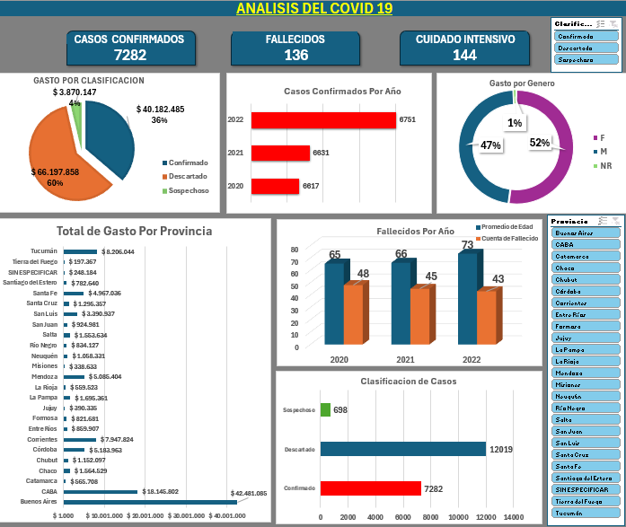

# 📊 Análisis de Datos de COVID-19 con Excel

Este proyecto consistió en procesar un dataset real con información de casos de COVID-19 en Argentina. Se utilizaron herramientas intermedias de Excel para transformar datos crudos en insights visuales y métricas clave.

## Objetivos
- Limpiar datos y seleccionar campos relevantes.
- Construir una tabla resumen con indicadores epidemiológicos.
- Crear un dashboard simple para visualizar los resultados.

## Herramientas utilizadas
- Filtros y ordenamientos
- Fórmulas condicionales y lógicas
- Tablas dinámicas
- Validación de datos
- Dashboard básico en hoja final

## Capturas del proyecto

## Descargar archivo Excel

📂 [Descargar Excel del proyecto](PF_Aguero_Garcia.xlsx)

## Resultado
Se logró transformar una hoja de datos crudos en un informe visualmente entendible, con indicadores clave como distribución por edad, sexo, provincia y clasificación del caso.
